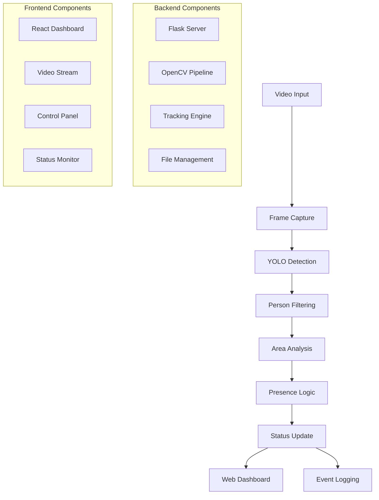

# 🎯 OpenCV-Based Real-time Employee Tracking System

[](https://opencv-based-real-time-employee.onrender.com)
[](https://python.org)
[](https://opencv.org)
[](https://flask.palletsprojects.com)
[](https://github.com/AlexeyAB/darknet)

An intelligent **Computer Vision-powered workplace monitoring system** that uses **YOLO object detection** and **OpenCV** to automatically track employee presence at workstations, providing real-time insights for productivity management and automated attendance tracking.

---

## 📋 Table of Contents

- [🎯 Features](#-features)
- [🚀 Live Demo](#-live-demo)
- [🛠️ Technologies Used](#️-technologies-used)
- [⚡ Quick Start](#-quick-start)
- [📦 Installation](#-installation)
- [🎮 Usage](#-usage)
- [🏗️ Architecture](#️-architecture)
- [📁 Project Structure](#-project-structure)
- [🔧 Configuration](#-configuration)
- [🌐 Deployment](#-deployment)
- [📊 Screenshots](#-screenshots)
- [🤝 Contributing](#-contributing)
- [📄 License](#-license)
- [👨‍💻 Author](#-author)

---

## 🎯 Features

### 🔍 **Computer Vision & AI**
- **Real-time Object Detection** using YOLOv4-tiny
- **Intelligent Person Recognition** with configurable confidence thresholds
- **Automated Desk Area Detection** or manual region specification
- **Smart Absence Detection** with customizable time thresholds
- **Real-time Video Processing** with optimized frame handling

### 🖥️ **Web Interface**
- **Responsive Dashboard** with modern dark theme
- **Live Video Streaming** with real-time overlays
- **Interactive Configuration Panel** for all detection parameters
- **Real-time Status Monitoring** with visual indicators
- **Comprehensive Logging System** with timestamped events
- **Video Upload Support** for demonstration and testing

### 📊 **Analytics & Monitoring**
- **Presence/Absence Tracking** with precise timing
- **Automated Alert System** for extended absences
- **Frame Processing Statistics** for performance monitoring
- **Comprehensive Event Logging** for audit trails
- **Visual Detection Overlays** (person boxes, monitoring areas)

### 🚀 **Deployment & Scalability**
- **Docker Containerization** for easy deployment
- **Cloud-Ready Architecture** with environment configuration
- **Auto-scaling Support** for production environments
- **Cross-platform Compatibility** (Windows, Linux, macOS)

---

## 🚀 Live Demo

**🌐 [Try the Live Demo](https://opencv-based-real-time-employee.onrender.com/)**

### Demo Instructions:
1. **Select "Upload Video"** as input source
2. **Upload a video file** containing people (MP4, AVI, MOV)
3. **Configure detection settings** (confidence, absence threshold)
4. **Click "Start Tracking"** to begin real-time analysis
5. **Watch the live monitoring** with detection overlays

> **Note**: Webcam functionality is disabled in the hosted demo for security reasons. Use video upload to demonstrate the system capabilities.

---

## 🛠️ Technologies Used

### **Backend**
-  **Python 3.9+** - Core application logic
-  **Flask** - Web framework and API
-  **OpenCV** - Computer vision and image processing
- **YOLO v4-tiny** - Real-time object detection
- **NumPy** - Numerical computations and array operations

### **Frontend**
-  **HTML5** - Structure and semantics
-  **CSS3** - Styling and animations
-  **JavaScript** - Interactive functionality
-  **Bootstrap 5** - Responsive design framework
- **Font Awesome** - Icons and visual elements

### **Deployment**
-  **Docker** - Containerization
- **Render** - Cloud hosting platform
- **Gunicorn** - WSGI HTTP Server

---

## ⚡ Quick Start

### Using Docker (Recommended)

```bash
# Clone the repository
git clone https://github.com/riyanshibariyaa/employee_tracking_system.git
cd employee_tracking_system

# Build and run with Docker
docker build -t employee-tracker .
docker run -p 5000:5000 employee-tracker

# Access the application
open http://localhost:5000
```

### Manual Installation

```bash
# Clone and setup
git clone https://github.com/riyanshibariyaa/employee_tracking_system.git
cd employee_tracking_system

# Create virtual environment
python -m venv venv
source venv/bin/activate  # On Windows: venv\Scripts\activate

# Install dependencies
pip install -r requirements.txt

# Run the application
python app.py

# Open browser
open http://localhost:5000
```

---

## 📦 Installation

### Prerequisites

- **Python 3.9+**
- **pip** (Python package manager)
- **Git** (for cloning repository)
- **Docker** (optional, for containerized deployment)

### System Dependencies

#### Ubuntu/Debian
```bash
sudo apt-get update
sudo apt-get install python3-opencv libglib2.0-0 libsm6 libxext6 libxrender-dev
```

#### macOS
```bash
brew install opencv python@3.9
```

#### Windows
```bash
# Install Python 3.9+ from python.org
# OpenCV will be installed via pip
```

### Python Dependencies

```bash
pip install -r requirements.txt
```

**Key Dependencies:**
- `Flask==2.3.3` - Web framework
- `opencv-python-headless==4.8.1.78` - Computer vision library
- `numpy==1.24.3` - Numerical computations
- `Werkzeug==2.3.7` - WSGI utilities
- `gunicorn==21.2.0` - Production server

---

## 🎮 Usage

### 1. **Application Startup**

```bash
python app.py
```

The application will:
- Download YOLO model files automatically
- Initialize the tracking system
- Start the web server on `http://localhost:5000`

### 2. **Configuration Options**

#### **Input Sources**
- **Webcam**: Use system camera (local development only)
- **Video Upload**: Upload MP4/AVI/MOV files for processing
- **Custom URL**: RTSP/HTTP video streams (advanced)

#### **Detection Parameters**
- **Absence Threshold**: Time (seconds) before marking as absent
- **Confidence Level**: YOLO detection confidence (0.1-1.0)
- **Monitoring Area**: Auto-detect or manually specify region

#### **Area Selection**
- **Auto-detect**: AI identifies desk/workspace areas
- **Manual**: Specify coordinates (x1,y1,x2,y2)

### 3. **Starting Tracking**

1. **Select input source** from dropdown
2. **Upload video file** (if using upload option)
3. **Configure detection settings** as needed
4. **Click "Start Tracking"** button
5. **Monitor real-time results** in the dashboard

### 4. **Understanding the Display**

#### **Video Overlays**
- 🟢 **Green Box**: Monitoring area boundary
- 🔴 **Red Box**: Employee detected in work area
- 🔵 **Blue Box**: Person detected outside work area

#### **Status Indicators**
- 🔴 **Active + Present**: Employee at workstation
- 🟡 **Active + Absent**: No employee detected
- ⚫ **Inactive**: System not running

---

## 🏗️ Architecture



### **Core Components**

#### **1. Video Processing Pipeline**
```python
Frame Capture → YOLO Detection → Person Filtering → Area Analysis → Status Update
```

#### **2. Detection Engine**
- **YOLOv4-tiny** for real-time object detection
- **OpenCV** for video processing and image manipulation
- **Custom algorithms** for area monitoring and presence logic

#### **3. Web Interface**
- **Flask backend** with RESTful API endpoints
- **Real-time video streaming** using multipart HTTP responses
- **WebSocket-like updates** via polling for status changes

#### **4. Data Flow**
```
Video Input → Processing Thread → Frame Queue → Web Stream → Browser Display
                    ↓
               Status Updates → API Endpoints → Frontend Updates
```

---

## 📁 Project Structure

```
employee_tracking_system/
│
├── 📄 app.py                          # Flask application entry point
├── 📄 employee_tracking_fixed.py      # Core tracking engine
├── 📄 requirements.txt                # Python dependencies
├── 📄 Dockerfile                      # Container configuration
├── 📄 render.yaml                     # Deployment configuration
├── 📄 README.md                       # This file
├── 📄 .gitattributes                  # Git configuration
│
├── 📁 templates/
│   └── 📄 index.html                  # Main web interface
│
├── 📁 uploads/                        # Video file storage (temp)
├── 📁 output_frames/                  # Captured frames
├── 📁 logs/                           # System logs
├── 📁 yolo_model/                     # YOLO model files (auto-downloaded)
│   ├── 📄 yolov4-tiny.weights
│   ├── 📄 yolov4-tiny.cfg
│   └── 📄 coco.names
│
└── 📁 static/                         # Static assets (if any)
```

### **Key Files Explained**

| File | Purpose | Key Features |
|------|---------|--------------|
| `app.py` | Flask web server | API endpoints, video streaming, file upload |
| `employee_tracking_fixed.py` | Core tracking logic | YOLO detection, presence tracking, threading |
| `index.html` | Web interface | Dashboard, controls, real-time updates |
| `requirements.txt` | Dependencies | All Python packages needed |
| `Dockerfile` | Container setup | Production deployment configuration |

---

## 🔧 Configuration

### **Environment Variables**

```bash
# Production settings
export FLASK_ENV=production
export PORT=5000
export MAX_CONTENT_LENGTH=16777216

# Detection settings
export CONFIDENCE_THRESHOLD=0.5
export ABSENCE_THRESHOLD=5
```

### **Application Settings**

Edit configuration in `employee_tracking_fixed.py`:

```python
# Default configuration
self.absence_threshold = 5          # Seconds before marking absent
self.confidence_threshold = 0.5     # YOLO confidence level
self.save_interval = 20             # Frame save frequency
```

### **YOLO Model Configuration**

The system automatically downloads:
- **yolov4-tiny.weights** (~23MB) - Pre-trained weights
- **yolov4-tiny.cfg** - Network configuration
- **coco.names** - Object class names

Custom models can be added by replacing these files.

---

## 🌐 Deployment

### **Local Development**

```bash
# Standard Python development
python app.py

# With debug mode
FLASK_ENV=development python app.py
```

### **Docker Deployment**

```bash
# Build image
docker build -t employee-tracker .

# Run container
docker run -p 5000:5000 -v $(pwd)/uploads:/app/uploads employee-tracker

# With environment variables
docker run -p 5000:5000 -e CONFIDENCE_THRESHOLD=0.6 employee-tracker
```

### **Cloud Deployment (Render)**

1. **Fork this repository** to your GitHub account
2. **Connect to Render**:
   - Go to [render.com](https://render.com)
   - Create new "Web Service"
   - Connect your GitHub repository
3. **Configure deployment**:
   - **Environment**: Docker
   - **Instance**: Free tier
   - **Auto-deploy**: Enable
4. **Deploy**: Render automatically builds and deploys

---

## 📊 Screenshots

### **🔴 Employee Absent Detection**

*System detecting employee absence - Person outside the monitoring area (blue box) with "Status: ABSENT" displayed. Green box shows the designated workspace monitoring zone.*

### **🟢 Employee Present Detection** 

*Active employee detection - Person detected within the workspace (red box) with "Status: PRESENT" and confidence score of 0.91. System accurately tracking employee presence at their workstation.*

---

## 🎯 **Key Visual Features Demonstrated**

| Feature | Description | Visual Indicator |
|---------|-------------|------------------|
| **🟢 Monitoring Area** | Auto-detected workspace boundary | Green rectangular box |
| **🔴 Employee at Desk** | Person detected in work area | Red box with "Employee: 0.91" |
| **🔵 Person Outside Area** | Person detected but not at workstation | Blue box with "Person: 0.88" |
| **📊 Real-time Status** | Live presence/absence tracking | "Status: PRESENT/ABSENT" overlay |
| **⏱️ Frame Processing** | Continuous video analysis | Frame counter and timestamp |
| **🎯 Confidence Scores** | AI detection accuracy | Numerical confidence values |

---

## 🔍 **Detection Logic Explained**

The screenshots above demonstrate the intelligent detection system:

1. **Green Box** = Defines the workspace monitoring area (auto-detected or manually set)
2. **Red Box** = Employee detected **within** the workspace → Status: **PRESENT**
3. **Blue Box** = Person detected **outside** the workspace → Status: **ABSENT**
4. **Confidence Scores** = YOLO detection accuracy (0.88-0.91 = high confidence)

This smart differentiation ensures accurate workplace monitoring by distinguishing between people at their workstation versus those simply passing by.

---

## 🎥 **Demo Video**

Want to see the system in action? Check out this quick demo:

[](https://drive.google.com/uc?export=view&id=YOUR_VIDEO_FILE_ID)

---

## 🔍 **Feature Highlights**

| Feature | Screenshot | Description |
|---------|------------|-------------|
| **Real-time Detection** |  | YOLO-powered person detection with confidence scores |
| **Smart Monitoring** |  | Automated desk area detection and presence tracking |
| **Modern Interface** |  | Clean, professional dashboard with real-time updates |

---

## 🎯 Use Cases

### **Enterprise Applications**
- **Office Attendance Tracking** - Automated employee presence monitoring
- **Remote Work Compliance** - Verify work-from-home productivity
- **Meeting Room Utilization** - Track conference room usage patterns
- **Security Monitoring** - Detect unauthorized access to workstations

### **Educational Institutions**
- **Classroom Attendance** - Automated student presence tracking
- **Library Monitoring** - Track study space utilization
- **Lab Supervision** - Ensure proper equipment usage

### **Healthcare Facilities**
- **Staff Monitoring** - Track healthcare worker presence
- **Patient Safety** - Monitor critical care areas
- **Equipment Usage** - Ensure proper workstation utilization

---

## 🚀 Future Enhancements

### **Planned Features**
- [ ] **Multi-person tracking** with individual identification
- [ ] **Advanced analytics** with productivity metrics
- [ ] **Integration APIs** for HR and payroll systems
- [ ] **Mobile app** for real-time notifications
- [ ] **Database integration** for historical data storage
- [ ] **AI-powered insights** and trend analysis

### **Technical Improvements**
- [ ] **GPU acceleration** for faster processing
- [ ] **WebRTC streaming** for lower latency
- [ ] **Kubernetes deployment** for scalability
- [ ] **Real-time notifications** via WebSocket
- [ ] **Advanced ML models** for better accuracy

---

## 🤝 Contributing

We welcome contributions! Here's how to get started:

### **Development Setup**

```bash
# Fork and clone the repository
git clone https://github.com/yourusername/employee_tracking_system.git
cd employee_tracking_system

# Create feature branch
git checkout -b feature/your-feature-name

# Make changes and test
python app.py

# Commit and push
git commit -m "Add your feature"
git push origin feature/your-feature-name

# Create pull request
```

### **Contribution Guidelines**

1. **Code Style**: Follow PEP 8 for Python code
2. **Testing**: Add tests for new features
3. **Documentation**: Update README for significant changes
4. **Commits**: Use clear, descriptive commit messages

### **Areas for Contribution**
- 🐛 **Bug fixes** and performance improvements
- ✨ **New features** and enhancements
- 📚 **Documentation** improvements
- 🧪 **Testing** and quality assurance
- 🎨 **UI/UX** improvements

---

## 📄 License

This project is licensed under the **MIT License** - see the [LICENSE](LICENSE) file for details.

```
MIT License

Copyright (c) 2024 Your Name

Permission is hereby granted, free of charge, to any person obtaining a copy
of this software and associated documentation files (the "Software"), to deal
in the Software without restriction, including without limitation the rights
to use, copy, modify, merge, publish, distribute, sublicense, and/or sell
copies of the Software, and to permit persons to whom the Software is
furnished to do so, subject to the following conditions:

The above copyright notice and this permission notice shall be included in all
copies or substantial portions of the Software.
```

---

## 👨‍💻 Author

**Your Name**
- 🌐 **Portfolio**: [your-portfolio.com](https://your-portfolio.com)
- 💼 **LinkedIn**: [linkedin.com/in/yourprofile](https://linkedin.com/in/yourprofile)
- 🐙 **GitHub**: [github.com/yourusername](https://github.com/yourusername)
- 📧 **Email**: your.email@example.com

---

## 🙏 Acknowledgments

- **[AlexeyAB/darknet](https://github.com/AlexeyAB/darknet)** - YOLO implementation
- **[OpenCV Team](https://opencv.org)** - Computer vision library
- **[Flask Team](https://flask.palletsprojects.com)** - Web framework
- **[Bootstrap Team](https://getbootstrap.com)** - UI framework

---

## 📈 Project Stats

[](https://github.com/yourusername/employee_tracking_system/stargazers)
[](https://github.com/yourusername/employee_tracking_system/network)
[](https://github.com/yourusername/employee_tracking_system/issues)
[](https://github.com/yourusername/employee_tracking_system/blob/main/LICENSE)

---

<div align="center">

**⭐ Star this repository if you found it helpful!**

**🚀 [Live Demo](https://opencv-based-real-time-employee.onrender.com) | 📖 [Documentation](https://github.com/yourusername/employee_tracking_system) | 🐛 [Report Bug](https://github.com/yourusername/employee_tracking_system/issues)**

</div>
